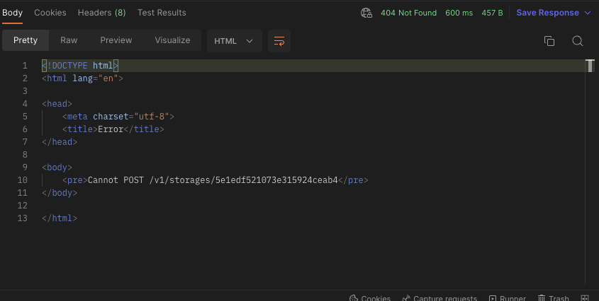
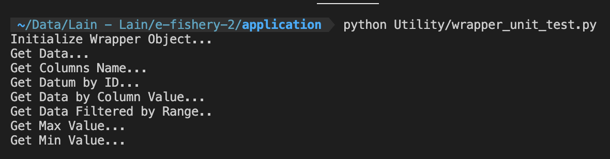

<b>Disclaimer</b>:
The specification states that there must be a function to add/update/delete data. However, I can't build those functions because the given API doesn't allow it (POST/PUT/DELETE)


How to use this library is as follows:
```py
from Utility.wrapper import Wrapper

ENDPOINT = 'http://...'
wrapper = Wrapper(ENDPOINT)
```

You can also run unit tests for this wrapper library by running the command:
```sh
python Utility/wrapper_unit_test.py
```
Unit Testing result


The built-in wrapper library can be seen in the Utility/wrapper.py folder. The functions in this library are as follows:
- refresh_data : retrieve data. This function is created because the data that has been obtained from the results of requests to the API is stored in the cache
- normalize_data_type : normalize the data type obtained from API requests
- get_data : return all data with filter : order_by, ascending, limit
- get_columns_name : return column names from data
- get_by_id : return a datum already filtered by id
- filter_by_column : return filtered data based on the value in a specific column
- filter_by_range : return data that has been filtered based on the range value in a specific column
- max_value : return the datum with the max value of the specific column
- max_value_by_range : return a datum with the max value of a specific column filtered by the timestamp range
- min_value : return a datum with the min value of a specific column
- min_value_by_range : return a datum with the min value of a specific column filtered by the timestamp range